# JAVA - STUDY 10주차 과제 : 멀티쓰레드 프로그래밍 

# 목표

---

자바의 멀티쓰레드 프로그래밍에 대해 학습하세요.

# 학습할 것 (필수)

---

-   Thread 클래스와 Runnable 인터페이스
-   쓰레드의 상태
-   쓰레드의 우선순위
-   Main 쓰레드
-   동기화
-   데드락

# 마감일시

---

2021년 1월 23일 토요일 오후 1시까지.

## Thread 클래스와 Runnable 인터페이스

---

#### Thread 란?

동시 프로그래밍에는 프로세스와 스레드의 두 가지 기본 실행 단위가 있습니다. JAVA 프로그래밍 언어에서 동시 프로그래밍은 대부분 스레드와 관련됩니다.

**프로세스**  
프로세스에는 완전한 개인용 기본 런타임 리소스 집합이 있고 자체 메모리 공간도 있습니다. JAVA 가상 머신의 대부분의 구현은 단일 프로세스로 실행됩니다.

**스레드**  
스레드는 경량 프로세스라고 부르기도 합니다. 프로세스와 스레드 모두 실행 환경을 제공하지만 스레드가 프로세스보다 만드는데 필요한 리소스가 더 적습니다.  
스레드는 프로세스 내에 존재하고, 모든 프로세스에는 최소한 하나의 스레드가 존재합니다. 우리가 자바 애플리케이션에서 main()을 실행하면 **메인 스레드**라고 하는 하나의 스레드로 시작을 하는 것입니다.

#### Thread를 수행하는 두 가지 방법이 있습니다.

1. Thread 클래스 상속

Thread 클래스에는 start() 메소드가 있어서 호출하면 run() 메소드가 실행되게 된다.

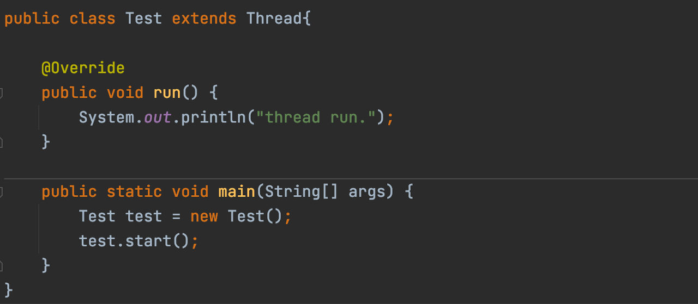

```
// 실행결과
thread run.
```

#### 실행 순서

여러 개의 쓰레드를 생성해서 실행해보면 어떨까?

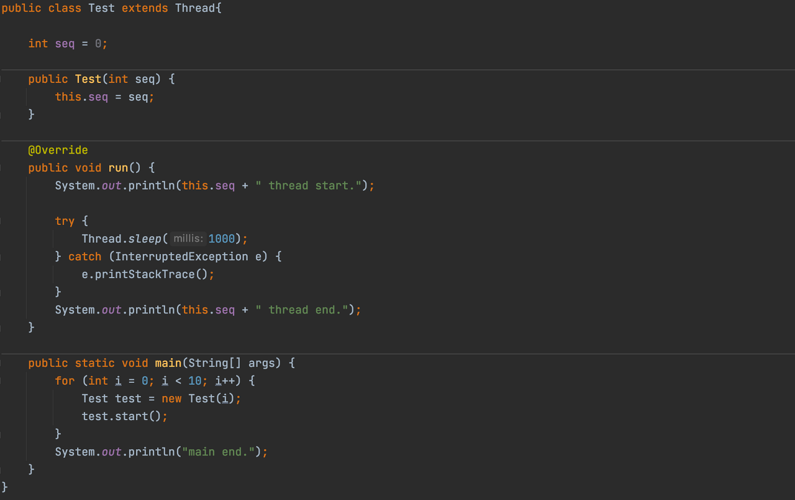

아래 실행 결과를 보면, 스레드의 실행 순서는 랜덤이고 매번 바뀌게 된다.

신기한 건 모든 스레드가 종료되기도 전에 main 메소드가 종료되었다.

```
1 thread start.
3 thread start.
2 thread start.
0 thread start.
4 thread start.
5 thread start.
6 thread start.
7 thread start.
8 thread start.
main end.
9 thread start.
1 thread end.
5 thread end.
9 thread end.
8 thread end.
3 thread end.
6 thread end.
2 thread end.
0 thread end.
7 thread end.
4 thread end.
```

#### 2\. Runnable 인터페이스 구현

-   Runnable 인터페이스에는 run() 메소드만 구현되어 있다.

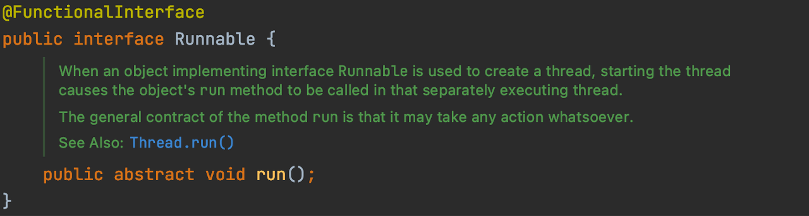

Thread클래스에 Runnable을 구현한 클래스를 넘겨야한다.

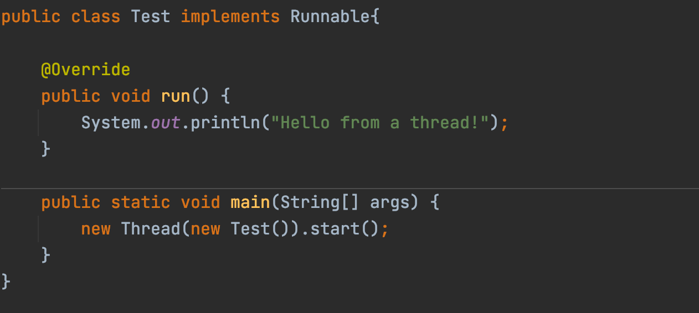

```
// 실행결과
Hello from a thread!
```

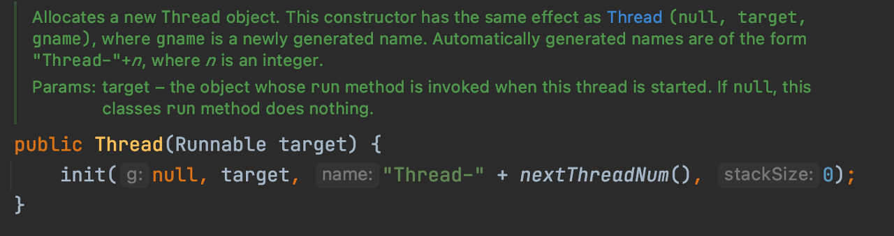

#### Thread, Runnable 둘 중 어떤 것을 사용해야 할까?

-   run() 메소드 이외에 다른 메소드를 오버라이딩 해야만 한다면 Thread 클래스
-   run() 메소드만 오버라이딩 한다면, Runnable 인터페이스를 구현하는게 일반적이다.

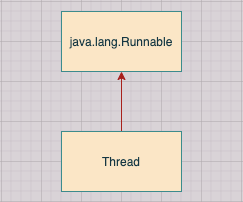

## Thread의 상태

---

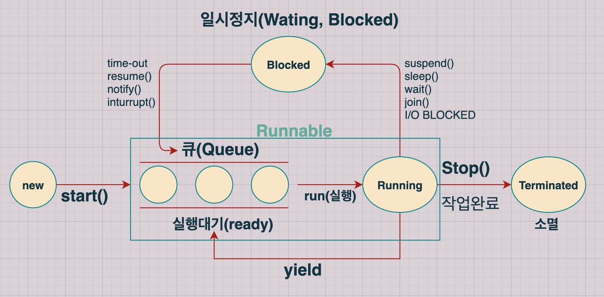

**1\. new (생성)**

쓰레드가 생성되고 아직 start()가 호출되지 않은 상태이다.

**2\. Runnable (준비상태)**

쓰레드가 실행되기 위한 준비단계입니다. CPU를 점유하고 있지않으며 실행(Running 상태)을 하기 위해 대기하고 있는 상태입니다. 코딩 상에서 start( ) 메소드를 호출하면 run( ) 메소드에 설정된 쓰레드가 Runnable 상태로 진입합니다.

**3\. Running (실행상태)**

CPU를 점유하여 실행하고 있는 상태이며 run() 메서드는 JVM만이 호출 가능. Runnable(준비상태)에 있는 여러 쓰레드 중 우선 순위를 가진 쓰레드가 결정되면 JVM이 자동으로 run( ) 메소드를 호출하여 쓰레드가 Running 상태로 진입.

**4\. Terminated (종료상태)**

쓰레드가 종료된 상태이다.

**4\. Blocked (지연 상태)**

CPU를 점유권을 상실한 상태이다. 후에 특정 메소드를 실행시켜 Runnable(준비상태)로 전환.

wait( ) 메소드에 의해 Blocked 상태가 된 스레드는 notify( ) 메소드가 호출되면 Runnable 상태로 간다. sleep(시간) 메소드에 의해 Blocked 상태가 된 스레드는 지정된 시간이 지나면 Runnable 상태로 간다.

#### Thread.sleep()

<table style="border-collapse: collapse; width: 100%;" border="1" data-ke-style="style8"><tbody><tr><td style="width: 50%;">Thread.sleep(long millis)</td><td style="width: 50%;">(1 / 1000) 초 만큼 Thread가 일시정지한다.</td></tr><tr><td style="width: 50%;"><span style="color: #333333;">Thread.sleep(long millis, int nanos)</span></td><td style="width: 50%;"><span style="color: #333333;">(1 / 1000) 초 + (1 / 1,000,000,000) 나노초 만큼 일시정지한다.</span></td></tr></tbody></table>

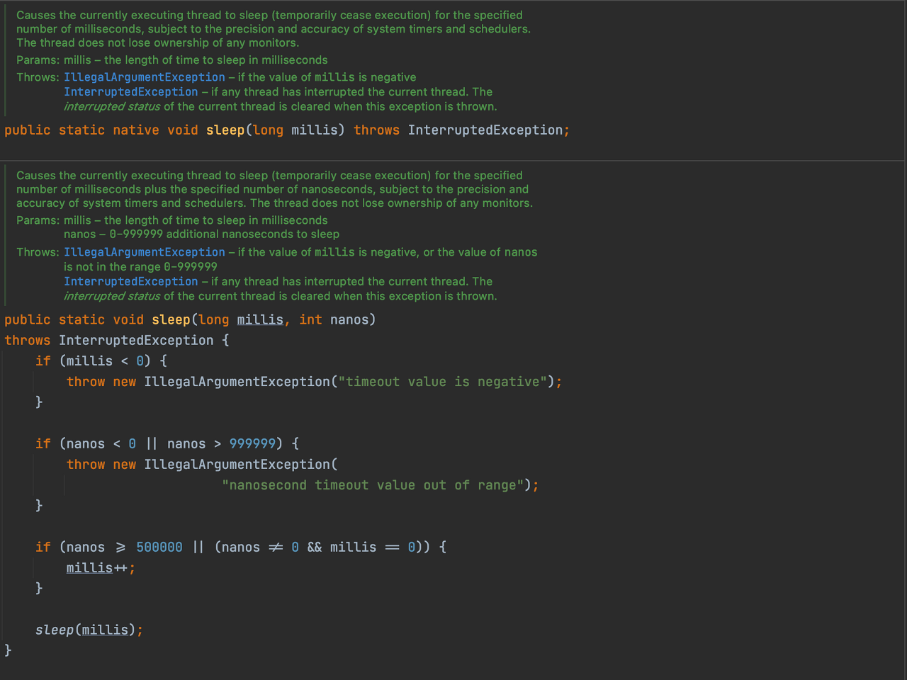

InterruptedException은 sleep이 활성 상태 인 동안 다른 스레드가 현재 스레드를 인터럽트 할 때 sleep이 던지는 예외이다.

sleep을 사용할 때에는 항상 try - catch로 감싸줘야 한다.

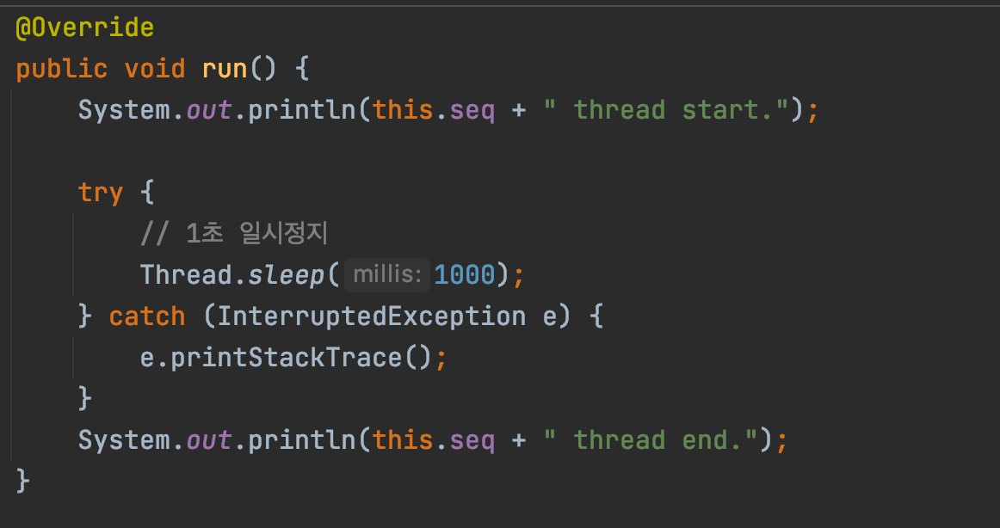

**그 외에 메소드**

<table style="border-collapse: collapse; width: 100%; height: 190px;" border="1" data-ke-style="style12"><tbody><tr style="height: 19px;"><td style="width: 18.1396%; height: 19px; text-align: center;"><b>Thread 메소드</b></td><td style="width: 31.8604%; height: 19px; text-align: center;"><b>설명</b></td></tr><tr style="height: 38px;"><td style="width: 18.1396%; height: 38px; text-align: center;">join()</td><td style="width: 31.8604%; height: 38px; text-align: center;">해당 쓰레드가 종료될 때까지 기다린다.</td></tr><tr style="height: 57px;"><td style="width: 18.1396%; height: 57px; text-align: center;">interrupt()</td><td style="width: 31.8604%; height: 57px; text-align: center;">현재 실행 중인 쓰레드를 중지시킨다. (InterruptedException 예외 발생)</td></tr><tr><td style="width: 18.1396%; text-align: center;">yield()</td><td style="width: 31.8604%; text-align: center;">자신의 작업시간을 다른 쓰레드에게 양보하고 자신은 대기상태가 된다.</td></tr><tr style="height: 19px;"><td style="width: 18.1396%; height: 19px; text-align: center;"><s><i>stop()</i></s></td><td style="width: 31.8604%; height: 19px; text-align: center;"><b>deprecated</b></td></tr><tr style="height: 19px;"><td style="width: 18.1396%; height: 19px; text-align: center;"><i><s><i><s>resume()</s></i></s></i></td><td style="width: 31.8604%; height: 19px; text-align: center;"><b>deprecated</b></td></tr><tr style="height: 19px;"><td style="width: 18.1396%; height: 19px; text-align: center;"><i><s>suspend()</s></i></td><td style="width: 31.8604%; height: 19px; text-align: center;"><b><b>deprecated</b></b></td></tr></tbody></table>

## Thread의 우선순위

---

각 Thread마다 자신의 우선순위를 가지고 있다. 이 우선순위가 높을수록 더 많은 시간동안 작업을 수행할 수 있다.

하지만 우선순위가 높다고 해서 가장 빨리 수행되는것도, 가장 먼저 실행되는 것도 아니다.

<table style="border-collapse: collapse; width: 100%; height: 57px;" border="1" data-ke-style="style4"><tbody><tr style="height: 19px;"><td style="width: 50%; height: 19px; text-align: center;">static int MAX_PRIORITY</td><td style="width: 50%; height: 19px; text-align: center;">쓰레드의 MAX 우선순위</td></tr><tr style="height: 19px;"><td style="width: 50%; height: 19px; text-align: center;"><span style="color: #333333;">static int MIN_PRIORITY</span></td><td style="width: 50%; height: 19px; text-align: center;"><span style="color: #333333;">쓰레드의 MIN 우선순위</span></td></tr><tr style="height: 19px;"><td style="width: 50%; height: 19px; text-align: center;"><span style="color: #333333;">static int NORM_PRIORITY</span></td><td style="width: 50%; height: 19px; text-align: center;">쓰레드가 생성될 때 주어지는 기본 우선순위 (5)</td></tr><tr><td style="width: 50%; text-align: center;" colspan="2"><span style="color: #333333;">&nbsp;* (쓰레드가 가질 수 있는 우선순위는 1부터 10까지이다)</span></td></tr></tbody></table>

**setPriority()** 와 **getPriority()** 메소드를 이용해 우선순위를 반환하거나 설정할 수 있다.
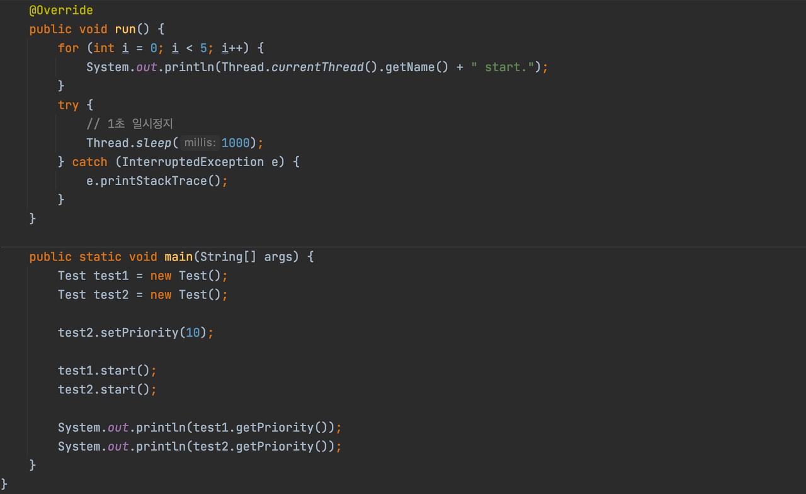
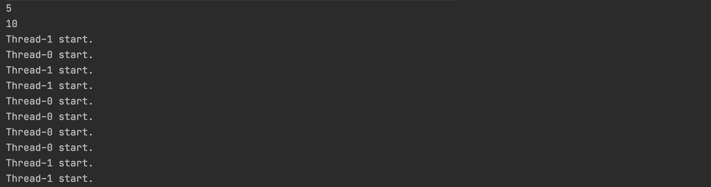

## Main Thread

---

#### **Single Thread Application**

java의 main() 메소드 " _**public static void main(String\[\] args)**_ " 이것이 메인 쓰레드이고, 다른 쓰레드를 생성하면 메인 쓰레드에서 파생되어서 다른 쓰레드가 생성되는 것이다.

메인 쓰레드 하나만 실행되는 것을 _**Single Thread Application**_ 이라고 한다.

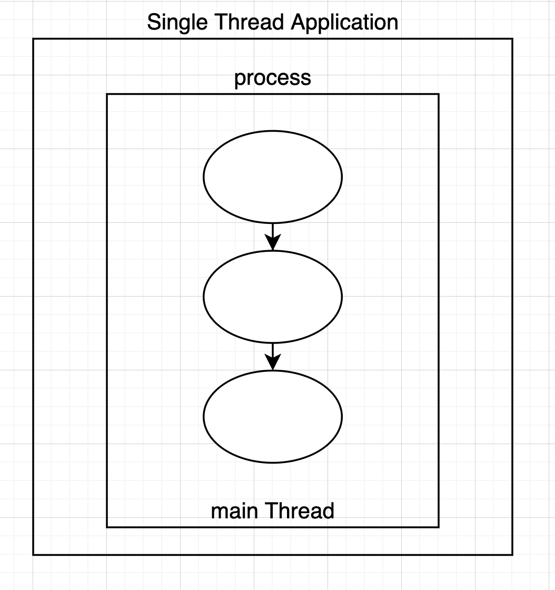

#### **Multi Thread Application**

메인 쓰레드에서 다른 쓰레드를 생성하여 실행하는 것을 Multi Thread Application이라고 한다.

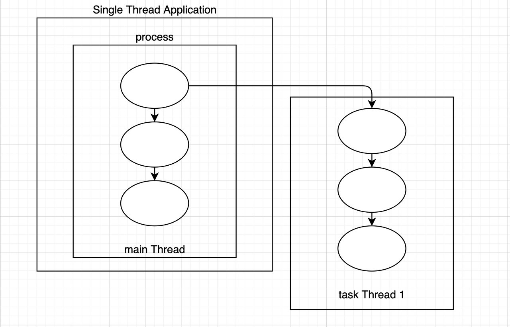

#### **Demon Thread**

main 쓰레드의 작업을 보조하는 역할을 한다.

그렇기에 main 쓰레드가 종료되면 함께 종료가 된다.

**(예제 코드)**

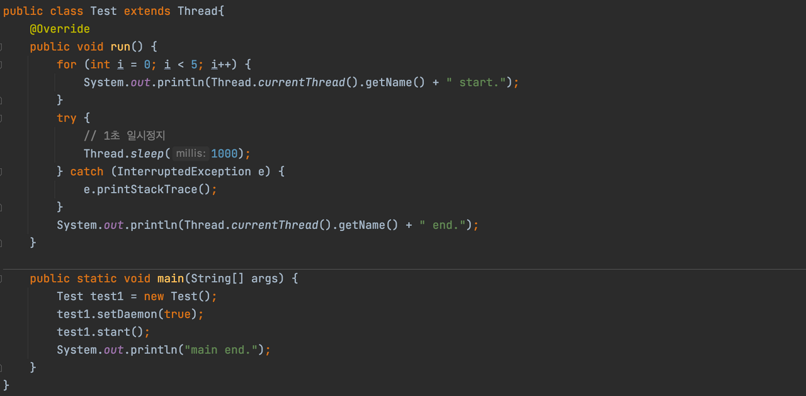

**(실행 결과)**

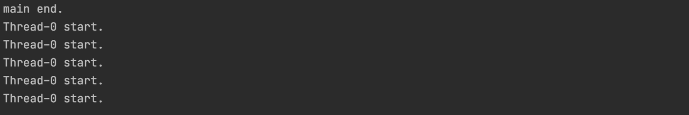

## 동기화 (Synchronize)

---

**임계 영역(Critical section) 과 잠금(lock)**

> 공유 데이터를 사용하는 코드 영역을 임계 영역으로 지정해놓고, 공유 데이터(객체)가 가지고 있는 lock을 획득한 단 하나의 쓰레드만 이 영역 내의 코드를 수행할 수 있도록 한다. 그리고 해당 쓰레드가 임계 영역 내의 모든 코드를 수행하고 벗어나서 lock을 반납해야만 다른 쓰레드가 반납된 lock을 획득하여 임계 영역의 코드를 수행할 수 있게 된다.

여러 개의 쓰레드가 한 개의 리소스를 사용하려고 할 때, 사용하려는 쓰레드를 제외한 나머지들을 접근하지 못하게 막는 것이다.

\-> _**Thread Safe (쓰레드 안전하다) , 하지만 너무 남발해서 사용하면 성능 저하를 일으킬 수 있음.**_

**Synchronized 사용법 2가지**

-   메소드에서 사용 (메소드 전체를 **임계 영역**으로 지정)

```
public synchronized void method() {	}
```

-   객체 변수에 사용 (락을 걸고자하는 객체를 참조하는 것이여야한다.)

```
private Object o = new Object();

public void method() {
	
    synchronized (o) {
    	// ...
    }
}
```

**(예제 코드) - synchronized 미 적용**

-   **Account 클래스**

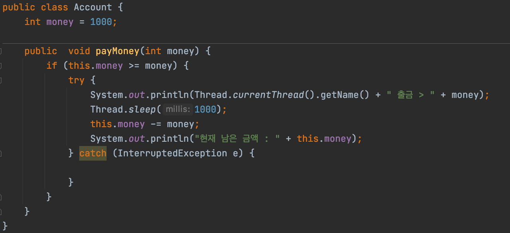

-   **Test 클래스**

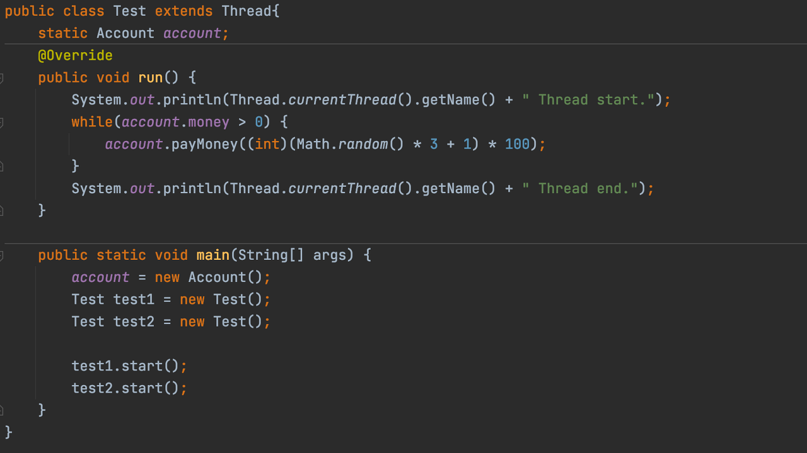

-   **실행결과**

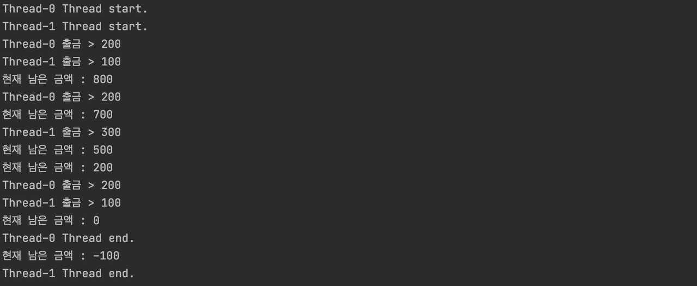

계좌 잔액보다 지불하는 금액이 더 크면, 지불하지 않도록 설정하였는데, 남은 금액이 -100이 되었다.

여기서 멀티스레드에 문제점이 발견되는 것이다. Thread-safe 하지 않기 때문에 Thread-0이 sleep에서 깨어나기도 전에 Thread-1가 출금을 해버린 것이다. 이제 synchronized를 메소드에 붙여주면 쉽게 해결이 된다!

**(예제코드) - Synchronized 적용**

-   **Account 클래스**

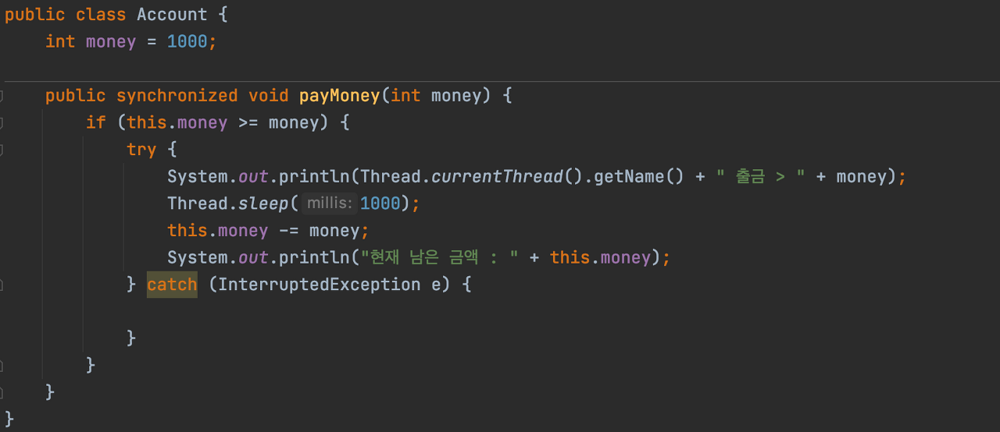

-   **Test 클래스 동일 (생략)**
-   **실행결과**

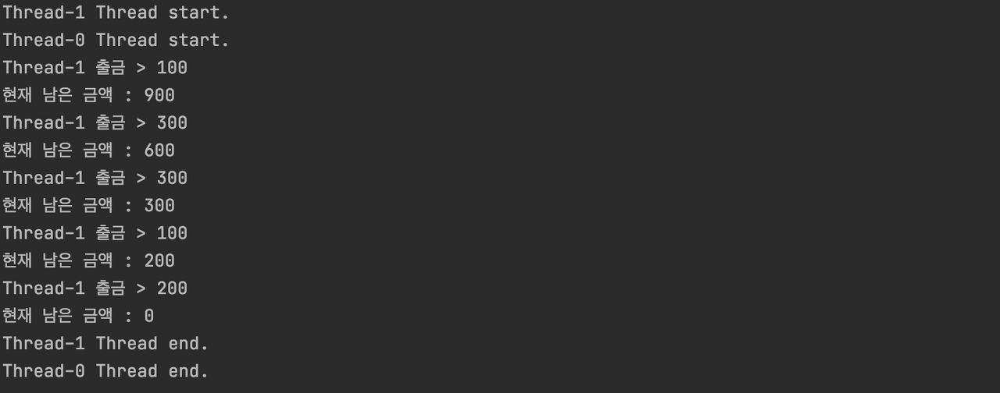

## 데드락 (DeadLock, 교착상태)

---

교착상태란, 둘 이상의 쓰레드가 lock을 획득하기 위해 대기하는데. 이 lock을 잡고 있는 쓰레드들도 똑같이 다른 lock을 기다리면서 서로 block 상태에 놓이는 것을 말한다. 데드락은 다수의 쓰레드가 같은 lock을 동시에, 다른 명령에 의해 획득하려 할 때 발생할 수 있다.

예시) Thread-1이 A의 lock을 가지고 있는 상태에서 B의 lock을 획득하려 한다. 그리고 Thread-2가 B의 lock을 가지고 있는 상태에서 A의 lock을 획득하려 한다. -> 데드락이 생긴다. (둘 다 서로가 획득하려는 A, B 의 lock을 영원히 획득할 수 없다.)

**(예제 코드)**

```
public class Test{
    static final Object lock_1 = new Object();
    static final Object lock_2 = new Object();

    private static class Sample1 extends Thread {
        @Override
        public void run() {
            synchronized (lock_1) {
                System.out.println("Thread 1 : Holding lock 1");
                try {
                    Thread.sleep(1000);
                } catch (InterruptedException e) {

                }
                System.out.println("Thread 1 : Wating for lock 2");
                synchronized (lock_2) {
                    System.out.println("Thread 1 : Holding lock 1 & 2");
                }
            }
        }
    }

    private static class Sample2 extends Thread {
        @Override
        public void run() {
            synchronized (lock_2) {
                System.out.println("Thread 2 : Holding lock 1");
                try {
                    Thread.sleep(1000);
                } catch (InterruptedException e) {

                }
                System.out.println("Thread 2 : Wating for lock 2");
                synchronized (lock_1) {
                    System.out.println("Thread 2 : Holding lock 1 & 2");
                }
            }
        }
    }

    public static void main(String[] args) {
        Sample1 thread1 = new Sample1();
        Sample2 thread2 = new Sample2();
        thread1.start();
        thread2.start();
    }
}

// 실행결과
Thread 1 : Holding lock 1
Thread 2 : Holding lock 1
Thread 1 : Wating for lock 2
Thread 2 : Wating for lock 1

```

서로의 lock을 얻으려고 호출하기 때문에 무한정 **데드락**에 빠지게 된다.

## **REFERENCES**

---

[tutorials.jenkov.com/java-concurrency/deadlock.html](http://tutorials.jenkov.com/java-concurrency/deadlock.html)

[docs.oracle.com/javase/tutorial/essential/concurrency/sleep.html](https://docs.oracle.com/javase/tutorial/essential/concurrency/sleep.html)

[parkcheolu.tistory.com/19](https://parkcheolu.tistory.com/19)

[codechacha.com/ko/java-synchronized-keyword/](https://codechacha.com/ko/java-synchronized-keyword/)

[wisdom-and-record.tistory.com/48](https://wisdom-and-record.tistory.com/48)

[sujl95.tistory.com/63](https://sujl95.tistory.com/63)

[coding-factory.tistory.com/279](https://coding-factory.tistory.com/279)