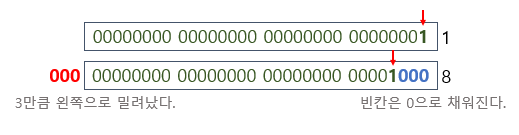

<br>

### 학습할 것

-   산술 연산자
-   비트 연산자
-   관계 연산자
-   논리 연산자
-   instanceof
-   assignment(=) operator
-   화살표(->) 연산자
-   3항 연산자
-   연산자 우선 순위
-   (optional) Java 13. switch 연산자

---

### 산술 연산자

-   **\+ 연산자**
-   **\- 연산자**
-   **\* 연산자**
-   **/ 연산자**
-   **% 연산자**

```
int a = 10;
int b = 5;

// +
System.out.println(a + b);

// -
System.out.println(a - b);

// *
System.out.println(a * b);

// /
System.out.println(a / b);

// %
System.out.println(a % b);

// string + string
String p = "abc";
String q = "def";
System.out.println(p + q);
```

> 15  
> 5  
> 50  
> 2  
> 0  
> abcdef

---

### 비트 연산자

-   **<<**
    -   정수 x의 각 비트를 y만큼 왼쪽으로 이동시킨다. (빈칸은 0으로 채워짐)



-   **\>>**
    -   정수 x의 각 비트를 y만큼 오른쪽으로 이동시킨다. (빈칸은 최상위 부호비트로 채워짐)


-   **\>>>**
    -   정수 x의 각 비트를 y만큼 오른쪽으로 이동시킨다.( >> 과 같지만, 다른점은 빈칸이 **0**으로 채워짐)


---

### 관계 연산자

-   **\> : 왼쪽 항이 크면 true, 아니면 false**
-   **< : 오른쪽 항이 크면 true, 아니면 false**
-   **\>= : 같거나 크면 true, 아니면 false**
-   **<= : 같거나 작으면 true, 아니면 false**
-   **\== : 같으면 true, 아니면 false**
-   **!= : 다르면 true, 아니면 false**

```
int a = 10;
int b = 5;

// > 연산자
System.out.println(a > b); // true
// < 연산자
System.out.println(a < b); // false
// >= 연산자
System.out.println(a >= b); // true
// <= 연산자
System.out.println(a <= b); // false
// == 연산자
System.out.println(a == b); // false
// != 연산자
System.out.println(a != b); // true
```

---

### 논리 연산자

-   논리 연산자
    -   논리곱(&&, &)
    -   논리합( ||, | )
    -   베타적 논리합( ^ )
    -   논리 부정 ( ! )

```
boolean a = true;
boolean b = false;
boolean c = true;

// 논리곱( &&,& ) : 둘 다 true일때 => true
System.out.println(a && b); // false
// 논리합( ||, | ) : 둘 중 하나만 true여도 => true
System.out.println(a || b); // true
// 베타적 논리합( ^ ) : 서로 다를 때만 true
System.out.println(a ^ c); // false
// 논리 부정( ! ) : true -> false / false -> true
System.out.println(!a); // false
```

---

### instanceof

-   해당 객체가 클래스의 인스턴스인지 확인

```
Parent parent = new Parent();
Child child = new Child();

System.out.println(parent instanceof Parent); // true
System.out.println(child instanceof Child); // true
System.out.println(child instanceof Parent); // false
```

---

### assignment(=) operator

-   대입 연산자 (=)
    -   += 
    -   \-=
    -   \*=
    -   /=
    -   %=
    -   ...

```
int a = 10;
int result = 0;

// +=
result += a; // result = result + a;
// -=
result -= a; // result = result - a;
// *=
result *= a; // result = result * a;
// /=
result /= a; // result = result / a;
// %=
result %= a; // result = result % a;
```

---

### 화살표(->) 연산자

자바 8 부터는 람다 표현식을 사용하여, 기존의 불필요한 코드를 줄여주고, 작성된 코드의 가독성을 높여준다.

람다 표현식으로 표현하면, 클래스를 작성하고 객체를 생성하지 않아도 메소드를 사용할 수 있다.

#### 람다 표현식 작성

> (매개변수)  ->  {Body}

#### 일반적인 표현

```
int min (int x, int y) {
	return x < y ? x : y;
}
```

#### 람다 표현식

```
(x, y) -> x < y ? x : y;
```

#### 익명 클래스

```
new Object() {
	int min(int x, int y) {
    	return x < y ? x : y;
    }
}
```

익명클래스는 선언과 동시에 객체를 생성하므로, 람다 표현식은 익명 클래스와 같다고 할 수 있다.

---

### 3항 연산자

if문을 사용하면 코드가 지저분해지고 길어지기 마련이다.

하지만, 3항 연산자를 사용하면 코드가 깔끔해진다.

#### 3항 연산자 문법

> (조건문)  ?  \[참일 때\] : \[거짓일 때\] ;

#### 코드

IF문

```
if ( N > 0 ) {
	return 1;
} else {
	return 0;
}
```

3항 연산자

```
return N > 0 ? 1 : 0;
```

엄청나게 코드가 깔끔해진걸 볼 수 있다. 

---

### 연산자 우선 순위

연산자 우선순위는 외우기 보다, 직접 코딩하면서 몸소 느끼게 되어있다. 물론 나도 하다보니 외워지게 되는...

<table style="border-collapse: collapse; width: 61.7443%; height: 284px;" border="1" data-ke-style="style15"><tbody><tr style="height: 19px;"><td style="width: 50%; text-align: center; height: 19px;"><span style="color: #000000;"><b>우선순위</b></span></td><td style="width: 50%; text-align: center; height: 19px;"><span style="color: #000000;"><b>연산자</b></span></td></tr><tr style="height: 18px;"><td style="width: 50%; text-align: center; height: 18px;"><span style="color: #000000;">1</span></td><td style="width: 50%; text-align: center; height: 18px;"><span style="color: #000000;"><b>.&nbsp;</b> &nbsp;,&nbsp; [ ]&nbsp; ,&nbsp; ( )&nbsp;</span></td></tr><tr style="height: 19px;"><td style="width: 50%; text-align: center; height: 19px;"><span style="color: #000000;">2</span></td><td style="width: 50%; text-align: center; height: 19px;"><span style="color: #000000;">++ , -- , ! , ~</span></td></tr><tr style="height: 19px;"><td style="width: 50%; text-align: center; height: 19px;"><span style="color: #000000;">3</span></td><td style="width: 50%; text-align: center; height: 19px;"><span style="color: #000000;">* , / , %</span></td></tr><tr style="height: 19px;"><td style="width: 50%; text-align: center; height: 19px;"><span style="color: #000000;">4</span></td><td style="width: 50%; text-align: center; height: 19px;"><span style="color: #000000;">+ , -&nbsp;&nbsp;</span></td></tr><tr style="height: 19px;"><td style="width: 50%; text-align: center; height: 19px;"><span style="color: #000000;">5</span></td><td style="width: 50%; text-align: center; height: 19px;"><span style="color: #000000;">&lt;&lt; , &gt;&gt; , &gt;&gt;&gt;</span></td></tr><tr style="height: 19px;"><td style="width: 50%; text-align: center; height: 19px;"><span style="color: #000000;">6</span></td><td style="width: 50%; text-align: center; height: 19px;"><span style="color: #000000;">&lt; , &gt; , &lt;= , &gt;= , instance of</span></td></tr><tr style="height: 19px;"><td style="width: 50%; text-align: center; height: 19px;"><span style="color: #000000;">7</span></td><td style="width: 50%; text-align: center; height: 19px;"><span style="color: #000000;">== , !=</span></td></tr><tr style="height: 19px;"><td style="width: 50%; text-align: center; height: 19px;"><span style="color: #000000;">8</span></td><td style="width: 50%; text-align: center; height: 19px;"><span style="color: #000000;">&amp;</span></td></tr><tr style="height: 19px;"><td style="width: 50%; text-align: center; height: 19px;"><span style="color: #000000;">9</span></td><td style="width: 50%; text-align: center; height: 19px;"><span style="color: #000000;">^</span></td></tr><tr style="height: 19px;"><td style="width: 50%; text-align: center; height: 19px;"><span style="color: #000000;">10</span></td><td style="width: 50%; text-align: center; height: 19px;"><span style="color: #000000;">|</span></td></tr><tr style="height: 19px;"><td style="width: 50%; text-align: center; height: 19px;"><span style="color: #000000;">11</span></td><td style="width: 50%; text-align: center; height: 19px;"><span style="color: #000000;">&amp;&amp;</span></td></tr><tr style="height: 19px;"><td style="width: 50%; text-align: center; height: 19px;"><span style="color: #000000;">12</span></td><td style="width: 50%; text-align: center; height: 19px;"><span style="color: #000000;">||</span></td></tr><tr style="height: 19px;"><td style="width: 50%; text-align: center; height: 19px;"><span style="color: #000000;">13</span></td><td style="width: 50%; text-align: center; height: 19px;"><span style="color: #000000;">? , :</span></td></tr><tr style="height: 19px;"><td style="width: 50%; text-align: center; height: 19px;"><span style="color: #000000;">14</span></td><td style="width: 50%; text-align: center; height: 19px;"><span style="color: #000000;">= , *= , /= , += , -= , %= ,..</span></td></tr></tbody></table>

---

### (optional) Java 13. switch 연산자

자바 13 이후 부터는 break 문 없이, yield를 사용하여 값을 리턴하면 된다.

#### Java 12 이전

```
private static int getValueBefore12(String mode) {
	int result = 0;
    
    switch (mode) {
    	case "a":
        case "b":
        	result = 1;
        	break;
        case "c":
        	result = 2;
	        break;
        case "d":
        case "e":
        case "f":
        	result = 3;
    	    break;
        default:
        	result = -1;
        	break;
	};
    
    return result;
}
```

#### Java 12

자바 12에서 지원했던 case를 여러개를 설정할 수가 있다.

```
// Java 12, multiple comma-separated labels
    private static int getValueMultipleLabels(String mode) {
        int result;
        switch (mode) {
            case "a", "b":
                result = 1;
                break;
            case "c":
                result = 2;
                break;
            case "d", "e", "f":
                result = 3;
                break;
            default:
                result = -1;
        }
        ;
        return result;
    }
```

value breaks(값을 바로 담아주면서 break 시키던 문법)는 이제 더이상 13에서는 사용할 수 없다.

```
 // value breaks are superseded by Java 13 'yield' statements.
    private static int getValueViaBreak(String mode) {
        int result = switch (mode) {
            case "a":
            case "b":
                break 1;
            case "c":
                break 2;
            case "d":
            case "e":
            case "f":
                break 3;
            default:
                break -1;
        };
        return result;
    }
```

자바 12에서 사용 하던,  -> (화살표 연산자)는 여전히 자바 13에서도 사용 할 수 있다.

```
// Java 12, switch expression returns a value via label rules (arrow)
    private static int getValueViaArrow(String mode) {
        int result = switch (mode) {
            case "a", "b" -> 1;
            case "c" -> 2;
            case "d", "e", "f" -> {
                // do something here...
                System.out.println("Supports multi line block!");
                yield 3;
            }
            default -> -1;
        };
        return result;
    }
```

#### Java 13

자바 13에서는 break 대신에 _**yield**_ 를 사용하여 값을 리턴할 수가 있다.

```
private static int getValueAfter13(String mode) {
	int result = switch (mode) {
    	case "a", "b" : 
        	yield 1;
		case "c" :
        	yield 2;
		case "d", "e", "f" :
        	yield 3;
		default :
        	yield -1;
    };
    return result;
}
```

---

## References :

[programmers.co.kr/learn/courses/5/lessons/144](https://programmers.co.kr/learn/courses/5/lessons/144)

[mkyong.com/java/java-13-switch-expressions/](https://mkyong.com/java/java-13-switch-expressions/)

[blog.naver.com/hsm622/222150928707](https://blog.naver.com/hsm622/222150928707)

[www.notion.so/efccbef42a38464bbacb63c71e3dd3d4?v=eb0b178f73e441f790fae45d4762ed3f](https://www.notion.so/efccbef42a38464bbacb63c71e3dd3d4?v=eb0b178f73e441f790fae45d4762ed3f)

[edu.goorm.io/learn/lecture/41/%EB%B0%94%EB%A1%9C%EC%8B%A4%EC%8A%B5-%EC%83%9D%ED%99%9C%EC%BD%94%EB%94%A9-%EC%9E%90%EB%B0%94-java/lesson/39380/%EC%97%B0%EC%82%B0%EC%9D%98-%EC%9A%B0%EC%84%A0%EC%88%9C%EC%9C%84](https://edu.goorm.io/learn/lecture/41/%EB%B0%94%EB%A1%9C%EC%8B%A4%EC%8A%B5-%EC%83%9D%ED%99%9C%EC%BD%94%EB%94%A9-%EC%9E%90%EB%B0%94-java/lesson/39380/%EC%97%B0%EC%82%B0%EC%9D%98-%EC%9A%B0%EC%84%A0%EC%88%9C%EC%9C%84)

[www.tcpschool.com/java/java\_lambda\_concept](http://www.tcpschool.com/java/java_lambda_concept)

[coding-factory.tistory.com/entry/Java-%EB%9E%8C%EB%8B%A4%EC%8B%9DLambda-Expressions-%EC%82%AC%EC%9A%A9%EB%B2%95-%EC%98%88%EC%A0%9C](https://coding-factory.tistory.com/entry/Java-%EB%9E%8C%EB%8B%A4%EC%8B%9DLambda-Expressions-%EC%82%AC%EC%9A%A9%EB%B2%95-%EC%98%88%EC%A0%9C)
