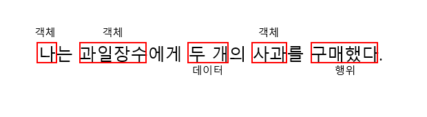
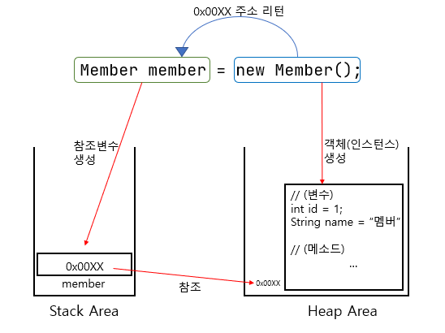
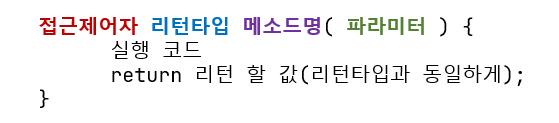
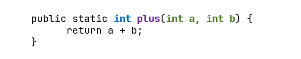
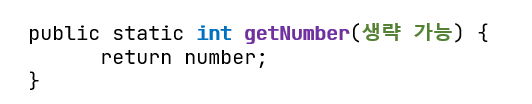
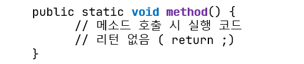

---

## **학습할 것**

---

-   클래스 정의하는 방법
-   객체 만드는 방법 (new 키워드 이해하기)
-   메소드 정의하는 방법
-   생성자 정의하는 방법
-   this 키워드 이해하기

### **클래스의 개념**

먼저 클래스의 개념에 대해서 짚고 넘어가야 할 것 같아서, 공부해 보았다.

**클래스**란 객체를 정의하는 틀 또는 설계도와 같은 의미로 사용됩니다. 자바에서는 이러한 설계도인 **클래스**를 가지고, 여러 객체를 생성하여 사용하게 됩니다.

**클래스**는 객체의 상태를 나타내는 **필드**와 객체의 행동을 나타내는 **메소드**로 구성이 됩니다.

**객체(Object)**

-   사전적 의미 : 물건 또는 대상
-   객체의 상태(state)와 행동(behavior)을 구체화하는 형태의 프로그래밍을 **객체 지향 프로그래밍**이라고 한다.

예를 들어서, "나는 과일장수에게 두 개의 사과를 구매했다"라는 문장을 보면




객체 지향 프로그래밍에서는 나, 과일장수, 사과라는 **객체**를 가지고 두 개의 사과를 구매하는 **행위**를 실체화 하는 것이다.

### **클래스 정의 하는 법**

---

```
class Member {
	// 필드(field)
	Long id;
	String name;

	// 생성자(constructor)
	public Member() {

	}

	// 메소드(method)
    	void setName(String name){
    		this.name = name;
    	}
    
    	..
}
```

### **객체 만드는 방법(new 키워드 이해하기)**

---

객체 지향 프로그래밍에서는 모든 데이터를 객체(Object)로 취급하며, 이러한 객체가 바로 프로그래밍의 중심이 됩니다.

```
Member member = new Member(); // 'member'라는 객체 생성
member.setId(1);
member.setName("멤버");
```

**!** **new 키워드로 생성한 객체의 메모리 할당**

-   member는 (인스턴스의 메모리 주소를 가지고 있다) 참조변수이지만 지역변수 이므로 **Stack 메모리**에 저장된다.
-   new 키워드로 생성된 Member 인스턴스는 생성된 순간 **Heap 메모리**에 저장되고, member의 id, name 정보도 함께 **Heap 메모리**에 저장된다.



-   **new**연산자는**객체**(**인스턴스**)를 생성시킨 후,**객체의 주소**를 리턴하도록 되어 있다.

**코드**

```
Member member;			// 참조변수 선언 : Member클래스의 객체를 참조하는 'member'라는 참조 변수 선언(메모리 로딩 전)
member = new Member();		// 인스턴스 화 : 객체를 생성한 후, 객체의 주소를 참조 변수에 저장 (메모리에 로딩 됨)

System.out.println(member);
```

**실행 결과**

```
Member@15db9742		// 주소 값이 찍힌다.
```

### **메소드 정의하는 방법**

---

```
public static '리턴타입(자료형 or void)'  '메소드명' ('넘겨받을 파라미터') {
	// 실행할 코드
    
    return ; // 리턴 타입이 void일 경우 return ; 또는 return 생략

}
```

#### **메소드 정의하는 방법**

-   **기본 문법**



-   파라미터는 여러개를 받을 수 있다.



-   파라미터는 생략 가능하다.
    -   ex) getter 메소드



-   리턴타입 void는 아무 값도 리턴을 안하겠다는 의미이다.



-   레퍼런스 타입도 파라미터로 줄 수 있다.

```
public void method(Member member) {
	// member가 참조하고 있는 주소 값이 넘어온다.
}
```

### **생성자 정의하는 방법**

---

#### **기본 생성자**

```
public 클래스명() {	}
```

#### **매개변수를 받는 생성자**

```
public class Member {
	int age;
    String name;
    
    public Member(int age, String name) {
    	this.age = age;
        this.name = name;
    }
}
```

### **this 키워드 이해하기**

---

```
public class Member {

	private int age;
    private String name;
    
    public Member(int age, String name){
    	this.age = age;		// this.age는 Member클래스 내에 선언된 age, age는 파라미터로 넘어온 변수를 뜻함.
        this.name = name;	// age랑 동일
    }
	..
    
    public Member getMember() {
    	return this;	// 현재 Member 객체의 주소값을 리턴
    }
}
```

## **과제 (Optional)**

---

-   int 값을 가지고 있는 이진 트리를 나타내는 Node 라는 클래스를 정의하세요.
-   int value, Node left, right를 가지고 있어야 합니다.
-   BinrayTree라는 클래스를 정의하고 주어진 노드를 기준으로 출력하는 bfs(Node node)와 dfs(Node node) 메소드를 구현하세요.
-   DFS는 왼쪽, 루트, 오른쪽 순으로 순회하세요.

## **REFERENCES**

---

[www.orentec.co.kr/teachlist/JAVA\_BASIC\_1/teach\_sub1.php](http://www.orentec.co.kr/teachlist/JAVA_BASIC_1/teach_sub1.php)

