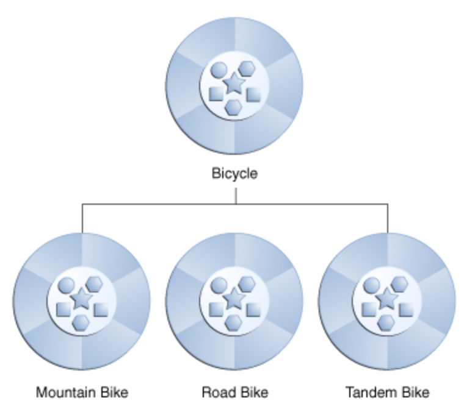

# JAVA - STUDY 6주차 과제 : 상속

### 학습 할 내용들
- 자바 상속의 특징
- super 키워드
- 메소드 오버라이딩
- 다이나믹 메소드 디스패치 (Dynamic Method Dispatch)
- 추상 클래스
- final 키워드
- Object 클래스

## 자바 상속의 특징
자전거를 예를 들어 보자.

산악 자전거, 로드 바이크, 하이브리드 등등 모두 자전거의 특성을 공유한다.
하지만 각각은 그들을 다르게 만드는 추가적인 특징들을 정의한다.

로드 바이크는 트랙에서 더 빠른 성능을 낼 수 있도록 얇은 바퀴와, 드롭 핸들바 등등
산악 자전거는 험난한 길에서 더 안정적인 주행을 할 수 있게 하는 기능들..

객체 지향 프로그래밍을 통해 클래스는 일반적으로 사용되는 상태 및 동작을 다른 클래스에서 상속할 수 있습니다.
위에서 들었던 예에서는 자전거가 로드바이크, 산악 자전거 등의 슈퍼 클래스(Super Class)가 된다.
JAVA 에서 각 클래스는 하나의 직접 슈퍼 클래스를 가질 수 있고, 슈퍼 클래스는 무제한의 하위 클래스를 사용할 수 있다.

## super 키워드

## 메소드 오버라이딩

## 다이나믹 메소드 디스패치 (Dynamic Method Dispatch)

## 추상 클래스

## final 키워드

## Object 클래스

# REFERENCES 