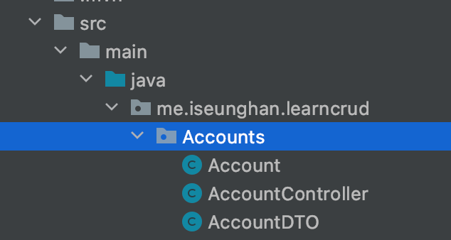
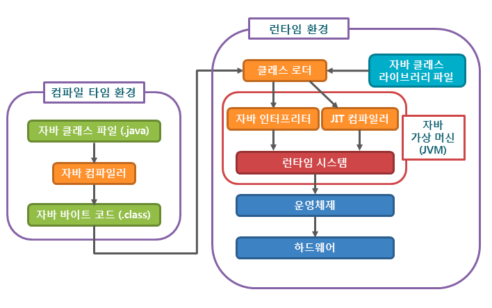
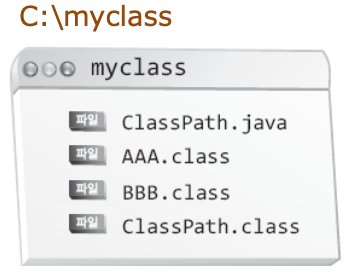
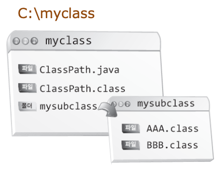
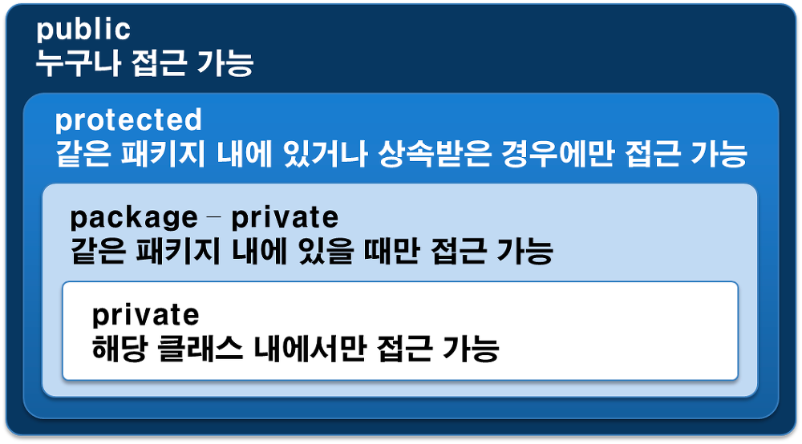
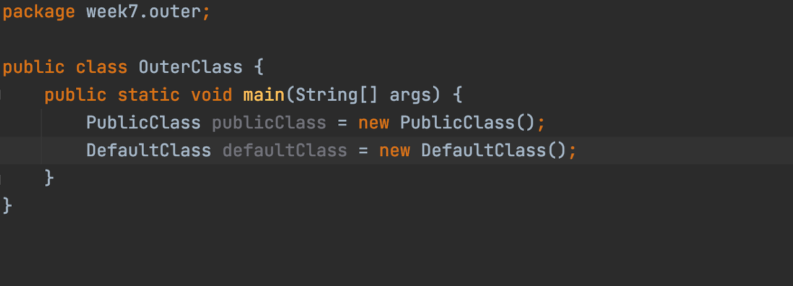
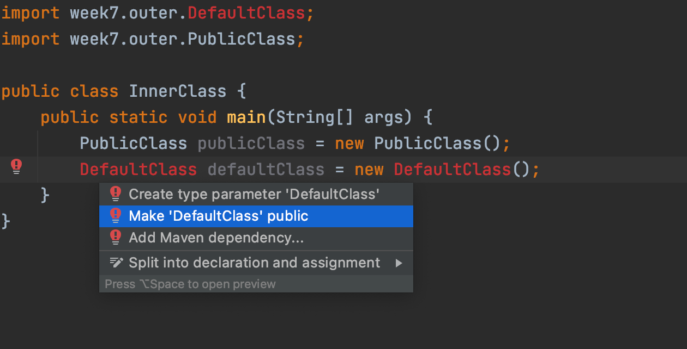
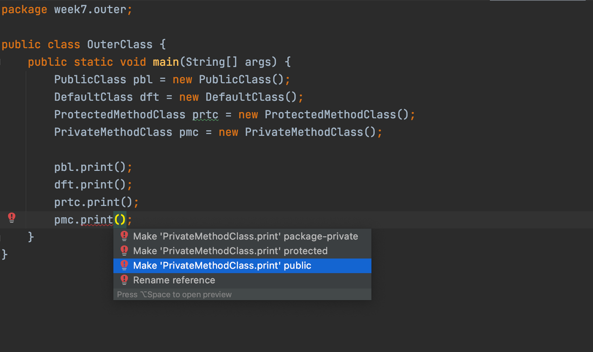
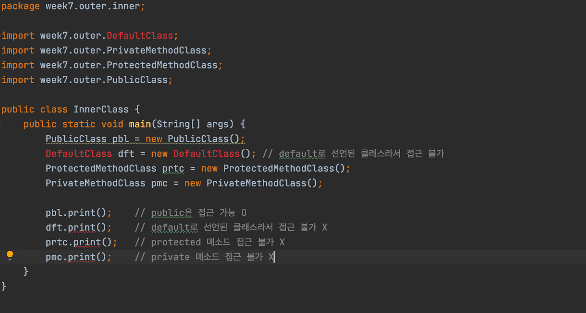

# JAVA - STUDY 7주차 과제

## 목표
자바의 패키지에 대해 학습하세요.

---

## 학습할 것 (필수)
- package 키워드
- import 키워드
- 접근제어자
- 클래스패스
- CLASSPATH 환경변수
- -classpath 옵션

---

## pacakage 키워드

우리가 컴퓨터에서 한 폴더 안에 비슷한 성질이 있는 파일들을 넣어서 정리하는 것 처럼 자바의 패키지도 이것과 동일한 개념이다.

**장점**

-   pacakage는 클래스의 분류가 용이하다. (비슷한 것 끼리 묶는다)
-   패키지가 다르다면 동일한 클래스명을 사용할 수 있다.

**Package 계층**



패키지 이름 규칙

<table style="border-collapse: collapse; width: 100%;" border="1" data-ke-style="style12"><tbody><tr><td>패키지 시작이름</td><td>내용</td></tr><tr><td>java</td><td>자바 기본 패키지(Java vendor 개발)</td></tr><tr><td>javax</td><td>자바 확장 패키지(J<span style="color: #333333;">ava vendor 개발)</span></td></tr><tr><td>org</td><td>일반적으로 비영리단체 (오픈소스) 패키지&nbsp;</td></tr><tr><td>com</td><td>일반적으로 영리단체(회사) 패키지</td></tr></tbody></table>

출처 : [kils-log-of-develop.tistory.com/430](https://kils-log-of-develop.tistory.com/430)

## import 키워드

외부 패키지의 클래스를 불러 사용하고자 할 경우엔 원래 클래스명 앞에 패키지를 명시해야 한다.

```
// pacakage 명시
me.iseunghan.accounts.Account account = new me.iseunghan.accounts.Account();
```

우리는 이것을 import 문으로 명시해줌으로써, 클래스가 속한 패키지명을 생략할 수 있는 것이다.


이런식으로 패키지를 명시할 때

```
// import를 해서 생략 가능
Account account = new Account();
```

#### 우리가 import를 생략해도 되는 경우,

java.lang.\* 패키지는 import를 해주지 않아도 사용할 수가 있다. (예 : String 클래스 등)

## 클래스패스

JVM이 자바 클래스 파일을 찾을 때 ClassPath 경로를 확인하여 클래스들의 위치를 확인한다.



자바 클래스 파일을 컴파일하면 자바 바이트 코드(.class) 로 변환이 되는데, java runtime(java 또는 jre)으로 이 .class 파일에 포함된 명령을 실행하기 위해 .class 파일을 찾는데 이때,  classpath에 지정된 경로를 사용해 찾는다.

classpath는 .class 파일이 포함된 디렉토리와 파일을 콜론(;)으로 구분한 목록이다.

이 classpath를 지정하기 위한 방법은 두가지가 있다.

-   CLASSPATH 환경변수 사용
-   java runtime에 -classpath 옵션 사용

## CLASSPATH 환경변수 사용



main 메소드는 ClassPath.class에 존재한다.

실행은 다음과 같다 : C;\\myclass> java ClassPath



그렇다면 AAA, BBB를 다른 폴더로 이동시켜서 실행을 한다면?

C:\\myclass> java ClassPath      -> error 발생!

[iseunghan.tistory.com/262](https://iseunghan.tistory.com/262)

[

Mac에서 JDK - 환경변수 설정하기

JDK 환경변수 설정 echo $PATH javac -version java -version 자바 경로 확인 cd /Library/Java/JavaVirtualMachines/jdk1.8.0\_251.jdk/Contents/Home .bash\_profile 환경 변수 설정 vi ~/.bash\_profile vi를 이..

iseunghan.tistory.com


](https://iseunghan.tistory.com/262)

## \-classpath 옵션

javc <options> <source files>

컴파일러가 컴파일 하기 위해서 필요로 하는 참조할 클래스 파일들을 찾기 위해서 컴파일시 파일 경로를 지정해주는 옵션


만약 필요한 클래스 파일(**AAA.class**,**BBB.class**)들이 mysubclass 폴더에 있으면,

javac -classpath C:\\myclass\\mysubclass C:\\myclass\\ClassPath.java 로 해주면 된다.

classpath 대신 단축어 cp를 사용해도 된다.

javac -cp C:\\myclass\\mysubclass C:\\myclass\\ClassPath.java

## 접근제어자



<table style="border-collapse: collapse; width: 100%;" border="1" data-ke-style="style12"><tbody><tr><td style="width: 21.9768%;">&nbsp;</td><td style="width: 17.9069%;"><b>public</b></td><td style="width: 20%;"><b>protected</b></td><td style="width: 20%;"><b>default</b></td><td style="width: 20%;"><b>private</b></td></tr><tr><td style="width: 21.9768%;">같은 패키지, 같은 클래스</td><td style="width: 17.9069%;">허용</td><td style="width: 20%;">허용</td><td style="width: 20%;">허용</td><td style="width: 20%;">허용</td></tr><tr><td style="width: 21.9768%;">같은 패키지, 상속 관계</td><td style="width: 17.9069%;">허용</td><td style="width: 20%;">허용</td><td style="width: 20%;">허용</td><td style="width: 20%;"><span style="color: #ee2323;"><b>불용</b></span></td></tr><tr><td style="width: 21.9768%;">같은 패키지, 상속 관계 아님</td><td style="width: 17.9069%;">허용</td><td style="width: 20%;">허용</td><td style="width: 20%;">허용</td><td style="width: 20%;"><span style="color: #ee2323;"><b>불용</b></span></td></tr><tr><td style="width: 21.9768%;">다른 패키지, 상속 관계</td><td style="width: 17.9069%;">허용</td><td style="width: 20%;">허용</td><td style="width: 20%;"><span style="color: #ee2323;"><b>불용</b></span></td><td style="width: 20%;"><span style="color: #ee2323;"><b>불용</b></span></td></tr><tr><td style="width: 21.9768%;">다른 패키지, 상속 관계 아님</td><td style="width: 17.9069%;">허용</td><td style="width: 20%;"><span style="color: #ee2323;"><b>불용</b></span></td><td style="width: 20%;"><span style="color: #ee2323;"><b>불용</b></span></td><td style="width: 20%;"><span style="color: #ee2323;"><b>불용</b></span></td></tr></tbody></table>

## **직접 해보기**

---

**패키지 계층**


이름에도 명시되있지만, PublicClass는 public으로 선언되어있고, DefaultClass는 defalut로 선언되어있는 클래스이다.

### **클래스 접근제어자**

-   public
-   default

#### 같은 클래스에서 접근 제어자



같은 패키지내에 있는 클래스라서 import를 안해줘도 사용할 수 있다.

하지만 다른 패키지인 inner.InnerClass에서 사용한다면?



> **import week7.outer.클래스명; ** import 키워드로 패키지를 선언해준다.

PublicClass는 사용하는데 문제 없지만,

DefaultClass를 public으로 만들라는 오류가 발생하게 된다!

---

### **메소드 접근제어자**

-   public
-   default
-   private
-   protected

#### 같은 패키지 내에서 접근

```
/* print()와 name은 각각 클래스의 이름과 같이 접근제어자가 붙었다. */

public void print(){
	System.out.println(name);
}

default void print(){
	System.out.println(name);
}

protected void print(){
	System.out.println(name);
}

private void print(){
	System.out.println(name);
}
```



#### 다른 패키지에서 접근



# **REFERENCES**

---

www.orentec.co.kr/teachlist/JAVA_BASIC_1/teach_sub1.php

www.tcpschool.com/java/java_modifier_accessModifier

[opentutorials.org/course/1223/6061](opentutorials.org/course/1223/6061)

[iseunghan.tistory.com/209](iseunghan.tistory.com/209)

[kils-log-of-develop.tistory.com/430](kils-log-of-develop.tistory.com/430)