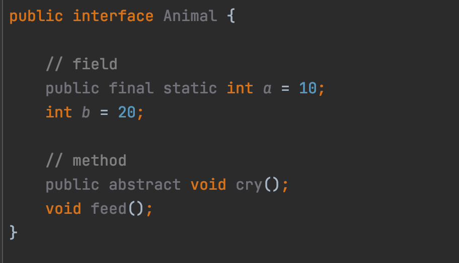

# JAVA - STUDY 8주차 과제 : 인터페이스

## 목표
자바의 인터페이스에 대해 학습하세요.

---

## 학습할 것 (필수)
- 인터페이스 정의하는 방법
- 인터페이스 구현하는 방법
- 인터페이스 레퍼런스를 통해 구현체를 사용하는 방법
- 인터페이스 상속
- 인터페이스의 기본 메소드 (Default Method), 자바 8
- 인터페이스의 static 메소드, 자바 8
- 인터페이스의 private 메소드, 자바 9

---

# 인터페이스 정의하는 방법
인터페이스를 정의할 때에는 키워드 interface 를 사용한다.
모든 필드는 public final static 이다.
모든 메소드는 public abstract 이다.



변수 a에는 _**final static**_ 을 붙여주고, b에는 생략을 해봤다.

메소드 cry와 feed도 마찬가지로 하나는 생략을 했다.

그렇지만 컴파일 에러가 나지 않고 잘 실행이 되었다. 왜그럴까??

아래 바이트 코드를 살펴보면 모든 필드, 메소드에 자동으로 추가가 되있는 것을 확인할 수 있다.


컴파일러가 자동으로 추가를 해준다. 즉, 생략이 가능하다는 의미이다.

---

## **인터페이스 구현하는 방법**

구현을 할 때에는 클래스를 상속받는 것처럼 _**extends(상속)**_ 대신 _**implements(구현)**_ 를 사용한다.

```
public interface Animal {

    void cry();
}

public class Cat implements Animal {

    public void cry() {
    	System.out.println("냐옹냐옹");
    }
}
```

---

## **인터페이스 레퍼런스를 통해 구현체를 사용하는 방법**

인터페이스는 다형성을 이용해 구현할 수 있다.

자식 클래스의 인스턴스를 부모클래스의 참조변수로 참조하는 것이 가능하다는 의미이다.

> 인터페이스는 객체의 타입으로만 사용된다.  
> 이 말은 상속에서와 같이 변수 선언 시에 객체의 타입으로 인터페이스를 사용할 수 있다는 것을 의미한다. 

List 인터페이스를 예를 들어보자.

List를 구현한 구현체들은 여러가지가 있다. (예: ArrayList, LinkedList ..등등)

아래와 같이 선언할 수 있다.

```
// 좋은 예 : 객체 타입을 인터페이스로 선언.
List<Integer> list = new ArrayList<Integer>();

// 나쁜 예 : 객체 타입을 클래스로 선언
ArrayList<Integer> list = new ArrayList<Integer>();
```

인터페이스 로 객체 타입을 선언하게 된다면, 추후에 클래스를 교체할 일이 생겼을 시에 클래스만 바꿔끼면 된다. 시스템이 유연해지게 만드는 것이다.

---

## **인터페이스 상속**

-   인터페이스 끼리 상속을 할 때에는 _**extends**_ 키워드를 사용한다.

```
public interface A {
	...
}

public interface B extends A {
	...
}
```

-   **인터페이스는 다중 상속이 가능하다.**
    -   **implements A, B , C ...**

```
public interface Animal {
	
    void cry();
}

public interface Pet {

    void play();
}


public class Cat implement Animal, Pet {

    public void cry() {
    	System.out.println("냐옹");
    }
    
    public void play() {
    	System.out.println("play!!");
    }
}
```

-   클래스와 인터페이스를 동시에 상속, 구현할 수 있다.

```
public class Animal {
	
    public void cry() {

    }
}

public interface Pet {

    void play();
}


public class Cat extends Animal implements Pet {

    public void cry() {
    	System.out.println("냐옹");
    }
    
    public void play() {
    	System.out.println("play!!");
    }
}
```

---

## **인터페이스의 기본 메소드 (Default Method), 자바 8**

-   자바 8 이후로 인터페이스는 기본 메소드(Default Method) 를 사용할 수 있게 되었다.
-   기존에는 인터페이스 내에 있는 메소드를 전부 다 오버라이딩 해야만 했지만, 기본 메소드는 반드시 구현할 필요 없다.
-   기본 메소드 (Defalut Method) 는 구현부(body) 를 가지게 된다.

```
public interface Camera {
    
    void takePhoto();
    
    /* default Method */
    default void takeVideo() {
        System.out.println("take a Video!");
    }
}

public interface MusicPlayer {
    
    void playMusic();
}


public class SmartPhone implements Camera, MusicPlayer{
    
    @Override
    public void takePhoto() {

    }

	// takeVideo 메소드를 구현하지 않아도 된다.

    @Override
    public void playMusic() {

    }
}
```

#### 만약 interface에 동일한 default 메소드가 선언되어 있다면?

> 컴파일 에러가 발생하기 때문에, 무조건 overriding을 해야한다.

```
public interface Camera {
    
    void takePhoto();
    
    default void takeVideo() {
        System.out.println("take a Video!");
    }
    
    default void print() {
        System.out.println("camera");
    }
}


public interface MusicPlayer {
    
    void playMusic();
    
    default void print() {
        System.out.println("Music");
    }
}


public class SmartPhone implements Camera, MusicPlayer{
    @Override
    public void takePhoto() {

    }

	// print()를 구현하지 않으면?

    @Override
    public void playMusic() {

    }
}

```

동일한 메소드를 오버라이딩(Overriding) 하지 않으면? 아래처럼 컴파일 에러가 발생하게 된다!


---

## **인터페이스의 static 메소드, 자바 8**

인터페이스의 추상성을 해친다는 이유로 제약을 걸어왔지만, 자바 8 부터는 개발의 유연성을 위해 static 메소드를 선언할 수 있게 되었다.

```
public interface MusicPlayer {
	static void info() {
    	System.out.println("Music Player!");
    }
}


public class Main {
	public static void main(String[] args){
    	MusicPlayer.info();	// Music Player!
    }
}
```

---

## **인터페이스의 private 메소드, 자바 9**

자바 9 이후로 _**private**_ 메소드 접근제어자도 사용할 수 있게 되었다.

```
public interface Camera {
	
	default void print() {
    	
        ..
    }
    
    private void info() {
    	
        ..
    }
}
```

---

## **REFERENCES**

---

[github.com/ByungJun25/study/tree/main/java/whiteship-study/8week#Interface-%EB%A0%88%ED%8D%BC%EB%9F%B0%EC%8A%A4%EB%A5%BC-%ED%86%B5%ED%95%B4-%EA%B5%AC%ED%98%84%EC%B2%B4-%EC%82%AC%EC%9A%A9%ED%95%98%EA%B8%B0](https://github.com/ByungJun25/study/tree/main/java/whiteship-study/8week#Interface-%EB%A0%88%ED%8D%BC%EB%9F%B0%EC%8A%A4%EB%A5%BC-%ED%86%B5%ED%95%B4-%EA%B5%AC%ED%98%84%EC%B2%B4-%EC%82%AC%EC%9A%A9%ED%95%98%EA%B8%B0)

[kils-log-of-develop.tistory.com/437](https://kils-log-of-develop.tistory.com/437)

[leegicheol.github.io/whiteship-live-study/whiteship-live-study-08-interface/](https://leegicheol.github.io/whiteship-live-study/whiteship-live-study-08-interface/)

[www.tcpschool.com/java/java\_polymorphism\_interface](http://www.tcpschool.com/java/java_polymorphism_interface)

[docs.oracle.com/javase/tutorial/java/IandI/interfaceAsType.html](https://docs.oracle.com/javase/tutorial/java/IandI/interfaceAsType.html)

[velog.io/@jaden\_94/8%EC%A3%BC%EC%B0%A8-%ED%95%AD%ED%95%B4%EC%9D%BC%EC%A7%80#5-%EC%9D%B8%ED%84%B0%ED%8E%98%EC%9D%B4%EC%8A%A4%EC%9D%98-%EA%B8%B0%EB%B3%B8-%EB%A9%94%EC%86%8C%EB%93%9C-default-method-%EC%9E%90%EB%B0%94-8](https://velog.io/@jaden_94/8%EC%A3%BC%EC%B0%A8-%ED%95%AD%ED%95%B4%EC%9D%BC%EC%A7%80#5-%EC%9D%B8%ED%84%B0%ED%8E%98%EC%9D%B4%EC%8A%A4%EC%9D%98-%EA%B8%B0%EB%B3%B8-%EB%A9%94%EC%86%8C%EB%93%9C-default-method-%EC%9E%90%EB%B0%94-8)