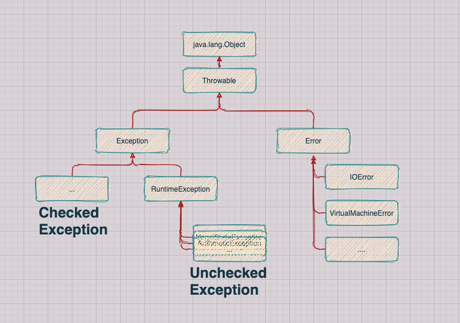
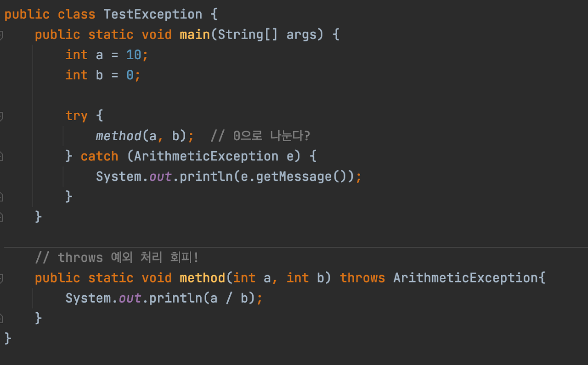

# 목표

---

자바의 예외 처리에 대해 학습하세요.

# 학습할 것 (필수)

---

-   Exception과 Error의 차이는?
    -   자바가 제공하는 예외 계층 구조
    -   RuntimeException과 RE가 아닌 것의 차이는?
-   자바에서 예외 처리 방법 (try, catch, throw, throws, finally)
-   커스텀한 예외 만드는 방법

---

## **Exception과 Error의 차이는 ?**

---

**java.lang.Object -> Throwable -> Exception, Error**



Error : JVM에 문제 (**OutOfMemoryError**, **StackOverFlowError** 와 같이 발생 시 복구할 수 없는 심각한 오류) 가 생긴 것을 의미한다.

-   컴파일 에러 : 컴파일 시점에 발생하는 에러이다. 컴파일러가 문법 검사를 통해 에러를 잡아주기 때문에 쉽게 해결할 수 있다.
-   논리적 에러 : 코드는 오류 없이 컴파일 및 실행되지만, 작업 결과가 예상과 다를 경우
-   런타임 에러 : 컴파일 에러가 없이 실행되더라도, 실행 과정(runtime)에서 발생하는 에러이다 (예외 : **Exception**). 이를 방지하기 위해 개발자가 예외 처리를 해줘야 한다.
    -   런타임 에러 예
        -   NullPointerException
        -   무한루프
        -   0으로 나누는 경우

**Exception** 은 **RuntimeException**을 기준으로 두 가지로 구분한다.

-   Checked Exception : RuntimeException을 제외한 모든 클래스
-   Unchecked Exception : RuntimeException과 모든 자식 클래스

---

<table style="border-collapse: collapse; width: 100%;" border="1" data-ke-style="style12"><tbody><tr><td style="width: 33.3333%; text-align: center;">&nbsp;</td><td style="width: 33.3333%; text-align: center;"><b><span style="color: #ffffff;">Checked Exception</span></b></td><td style="width: 33.3333%; text-align: center;"><b>Unchecked Exception</b></td></tr><tr><td style="width: 33.3333%; text-align: center;">처리여부</td><td style="width: 33.3333%; text-align: center;">반드시 예외 처리</td><td style="width: 33.3333%; text-align: center;">예외 처리를 강제하지 않음</td></tr><tr><td style="width: 33.3333%; text-align: center;">확인시점</td><td style="width: 33.3333%; text-align: center;">컴파일 단계</td><td style="width: 33.3333%; text-align: center;">실행 단계</td></tr><tr><td style="width: 33.3333%; text-align: center;">예외 발생 시 트랜잭션 처리</td><td style="width: 33.3333%; text-align: center;">roll-back (X)</td><td style="width: 33.3333%; text-align: center;">roll-back (O)</td></tr><tr><td style="width: 33.3333%; text-align: center;">대표 예외</td><td style="width: 33.3333%; text-align: center;">RuntimeException을 제외한 모든 예외</td><td style="width: 33.3333%; text-align: center;">RuntimeException 하위 예외</td></tr></tbody></table>

## **자바에서 예외 처리 방법 (try, catch, throw, thorws, finally)**

---

> 예외란?  
> 나이를 입력하라고 했는데, 0보다 작은 값이 입력되었다.  
> 나눗셈을 위한 두 개의 정수를 입력하라고 했는데, 제수(나누는 수)를 0이 입력되었다.

### try ~ catch 문

```
// 예외가 발생 가능한 부분을 감싼다.
try
{
    System.out.println("나누기 시작");
    System.out.println("나눗셈 결과의 몫 : " + (num1 / num2));	// (1) 예외 발생!
    System.out.println("나눗셈 결과의 나머지 : " + (num1 % num2));	// (2)
}

// 예외가 발생하면 처리되는 코드
catch(ArithmeticException e)
{
    System.out.println("ArithmeticException 발생! 0이 입력되었습니다.");
}

// 예외처리가 끝나고 나서 처리
System.out.println("프로그램을 종료합니다.");

// 실행결과
나누기 시작
ArithmeticException 발생! 0이 입력되었습니다.
프로그램을 종료합니다.
```

**정리**

-   try는 예외발생의 감지 대상을 감싸는 목적으로 사용된다.
    -   **try 문 코드를 살펴보면, (1)** 예외발생하면 , **(2) **는 실행되지 않는다.
-   catch는 발생한 예외상황의 처리를 위한 목적으로 사용된다. (예외가 발생하지 않으면 -> catch문 실행 **X**)

### 여러 개의 catch 문

**catch** 문을 여러 개로 작성할 수 있다.

```
try
{
    System.out.println("나눗셈 결과의 몫 : " + (num1 / num2));	// (1) 예외 발생!
}

// 여러 개 catch 문 작성 가능!
catch(ArithmeticException e1)
{
    System.out.println("ArithmeticException 발생!");
}
catch(NullPointerException e2)
{
    System.out.println("NullPointerException 발생!");
}
catch(Exception e3)
{
    System.out.println("Exception 발생!");
}


// 실행 결과
ArithmeticException 발생!
```

현재 **ArithmeticException**이 발생하기 때문에 첫번째 **catch**문이 실행 된다.

### 멀티 catch 문

Java 7 이후 부터는 여러 개의 **Exception**을 하나의 catch 문에  **'|'** 으로 합칠 수 있다.

-   주의 사항
    -   부모 / 자식 관계의 있는 예외 클래스를 동시에 작성은 컴파일 에러가 발생한다.
        -   (예) **NullPointerException** extends **RuntimeException**

```
try
{
	// 예외 발생!
}

// 멀티 catch
catch(ArithmeticException | NullPointerException e1)
{
	// 예외 처리
}
catch(NullPointerException | RuntimeException e2)
{
	// 부모와 자식관계에 있는 예외 클래스가 동시에 있으면 안됨!
}
```

### finally

```
try 
{
	System.out.println(1 / 0);	// 예외 발생!
}

catch (ArithmeticException e)
{
	System.out.println("예외를 처리하는 코드");
}

finally
{
	System.out.println("이 문장은 마지막에 꼭! 출력됩니다.");
}

// 실행 결과
예외를 처리하는 코드
이 문장은 마지막에 꼭! 출력됩니다.
```

**finally**

-   try ~ catch 가 실행되고 난 뒤, 항상 실행된다.
-   예외가 발생 하지 않아도 실행된다.

### throw

throw 키워드를 이용해서 고의로 예외를 발생시키는 것이다. 만약 제수(나누는 수)가 0이 입력되었으면, **ArithmeticException**을 던져서 프로그램을 중단 시키는 것이다.

```
try
{
    int a = 10;
    int b = 0;
    
    if(b == 0) {
    	throw new ArithmeticException("0이 입력 되었습니다.");
    }else {
    	System.out.println(a / b);
    }
}

catch (ClassNotFoundException e)
{
    System.out.println(e.getMessage());
}

// 실행 결과
0이 입력 되었습니다.
```

```
ArithmeticException e = new ArithmeticException("0이 입력되었습니다.");
throw e;

// 위 문장을 축약해서 아래와 같이 사용
throw new ArithmeticException("0이 입력되었습니다.");
```

### throws

thorws 키워드는 예외처리 회피를 하는 것이다. 예외가 발생하면 thorws를 통해 호출 한 쪽으로 예외를 던지고 그 예외처리를 회피하는 것이다. 무책임하게 던지면 안되고, 현재 메소드에서 이 예외를 던지는 것이 최선의 방법이라는 확신이 있을 때만 사용해야 한다.



실행 결과

```
/ by zero
```

## **커스텀 한 예외 만드는 방법**

---

Main.java

```
public class Main {
    public static void main(String[] args) throws AgeException {
        setAge(-1);	// 나이에 -1을 입력
    }

    private static void setAge(int age) throws AgeException {
        if (age < 0) {
            throw new AgeException("나이를 다시 입력하세요.");
        }
    }
}

```

AgeException.java

```
public class AgeException extends Exception{

    public AgeException() {

    }

    public AgeException(String message) {
        super(message);
    }
}
```

실행 결과

```
Exception in thread "main" week9.AgeException: 나이를 다시 입력하세요.
	at week9.Main.setAge(Main.java:11)
	at week9.Main.main(Main.java:6)
```

## **REFERENCES**

---

[itmining.tistory.com/9](https://itmining.tistory.com/9)

[finewoo.tistory.com/22](https://finewoo.tistory.com/22)

[madplay.github.io/post/java-checked-unchecked-exceptions](https://madplay.github.io/post/java-checked-unchecked-exceptions)

[m.blog.naver.com/PostView.nhn?blogId=highkrs&logNo=220239297118&proxyReferer=https:%2F%2Fwww.google.com%2F](https://m.blog.naver.com/PostView.nhn?blogId=highkrs&logNo=220239297118&proxyReferer=https:%2F%2Fwww.google.com%2F)

[woodforest.tistory.com/173](https://woodforest.tistory.com/173)

[www.nextree.co.kr/p3239/](https://www.nextree.co.kr/p3239/)

[linked2ev.github.io/java/2019/05/05/JAVA-5.-compileError-vs-RuntimeError/](https://linked2ev.github.io/java/2019/05/05/JAVA-5.-compileError-vs-RuntimeError/)

[wisdom-and-record.tistory.com/46](https://wisdom-and-record.tistory.com/46)

[catch-me-java.tistory.com/46](https://catch-me-java.tistory.com/46)

[velog.io/@youngerjesus/%EC%9E%90%EB%B0%94-%EC%98%88%EC%99%B8-%EC%B2%98%EB%A6%AC#2-%EC%9E%90%EB%B0%94%EA%B0%80-%EC%A0%9C%EA%B3%B5%ED%95%98%EB%8A%94-%EC%98%88%EC%99%B8-%EA%B3%84%EC%B8%B5-%EA%B5%AC%EC%A1%B0](https://velog.io/@youngerjesus/%EC%9E%90%EB%B0%94-%EC%98%88%EC%99%B8-%EC%B2%98%EB%A6%AC#2-%EC%9E%90%EB%B0%94%EA%B0%80-%EC%A0%9C%EA%B3%B5%ED%95%98%EB%8A%94-%EC%98%88%EC%99%B8-%EA%B3%84%EC%B8%B5-%EA%B5%AC%EC%A1%B0)

[leegicheol.github.io/whiteship-live-study/whiteship-live-study-09-exception-handling/#runtimeexception%EA%B3%BC-re%EA%B0%80-%EC%95%84%EB%8B%8C-%EA%B2%83%EC%9D%98-%EC%B0%A8%EC%9D%B4%EB%8A%94](https://leegicheol.github.io/whiteship-live-study/whiteship-live-study-09-exception-handling/#runtimeexception%EA%B3%BC-re%EA%B0%80-%EC%95%84%EB%8B%8C-%EA%B2%83%EC%9D%98-%EC%B0%A8%EC%9D%B4%EB%8A%94)